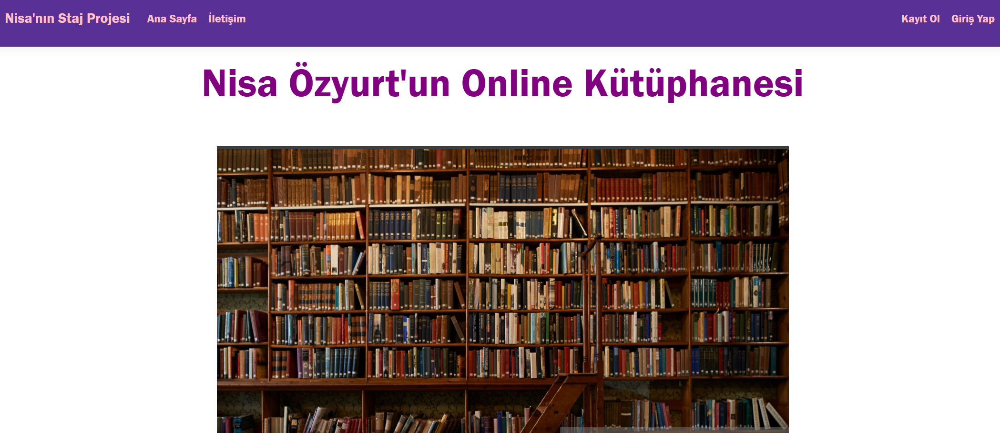
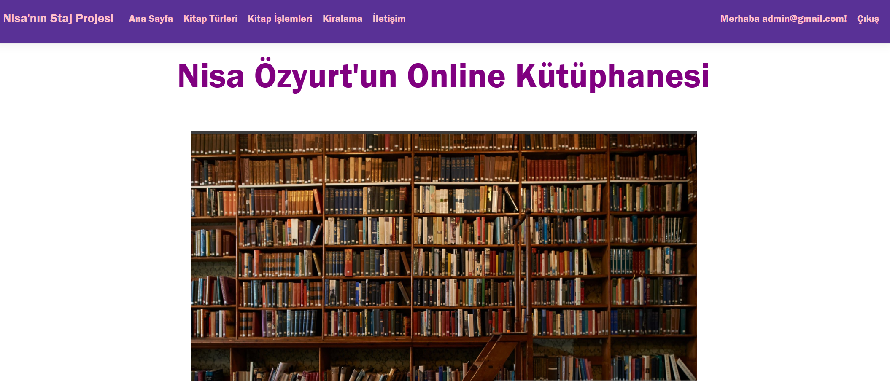
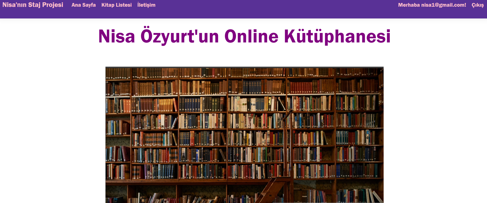
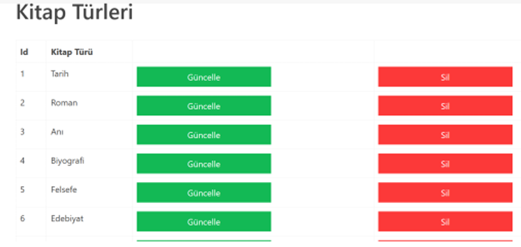

#  Online Kütüphane Otomasyon Sistemi

Bu proje, bir kütüphanenin dijital yönetim süreçlerini simüle eden, **Admin** ve **Öğrenci** olmak üzere iki farklı kullanıcı paneline sahip web tabanlı bir yönetim sistemidir. Staj projesi kapsamında geliştirilmiştir.

---

##  Kullanılan Teknolojiler

* **Framework:** ASP.NET Core 7.0 (MVC)
* **Database:** Microsoft SQL Server (MSSQL)
* **ORM:** Entity Framework Core
* **Arayüz:** Bootstrap 5, CSS3, HTML5

---

##  Temel Özellikler

### Kimlik Doğrulama
* Kullanıcı dostu Giriş Yap (Login) ekranı.
* Rol tabanlı yetkilendirme (Admin ve Öğrenci ayrımı).

###  Admin Paneli
* **Kitap Yönetimi:** Yeni kitap ekleme, mevcut kitapları güncelleme ve silme (CRUD).
* **Üye Yönetimi:** Sisteme kayıtlı öğrencileri görüntüleme ve yönetme.

###  Öğrenci Paneli
* **Kitap Listeleme:** Kütüphanedeki tüm kitapları görüntüleme.
* **Arama & Filtreleme:** Kitap adına veya yazara göre hızlı arama.

* ##  Ekran Görüntüleri

**Giriş Ekranı:**


**Admin Paneli:**

**Kullanıcı Paneli:**

**Güncelle-Sil Paneli:**


---
##  Kurulum ve Çalıştırma

1.  **Projeyi Klonlayın:**
    ```bash
    git clone [https://github.com/NisaOzyDev/Online_Kutuphane_admin_ve_Ogrenci_girisli.git](https://github.com/NisaOzyDev/Online_Kutuphane_admin_ve_Ogrenci_girisli.git)
    ```
2.  **Veritabanı Yapılandırması:**
    appsettings.json dosyasındaki Connection String kısmını kendi yerel SQL Server bilgilerinizle güncelleyin.
3.  **Migration Uygulayın:**
    Visual Studio - Package Manager Console üzerinden:
    ```powershell
    Update-Database
    ```
4.  **Projeyi Çalıştırın:** F5 veya dotnet run.
